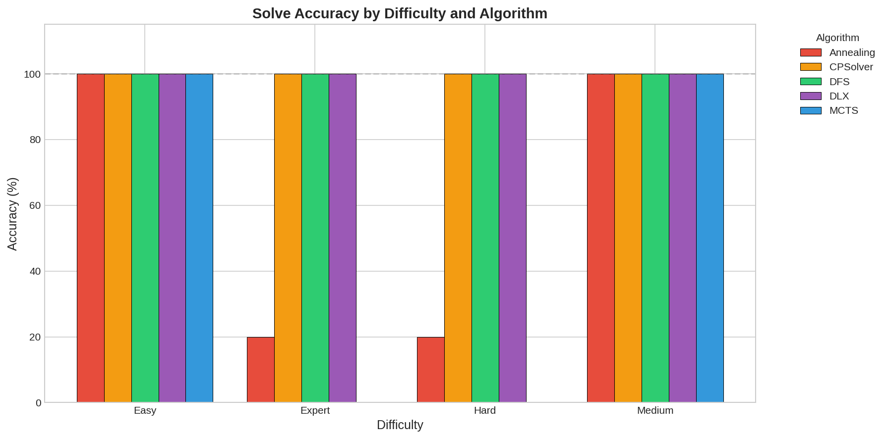
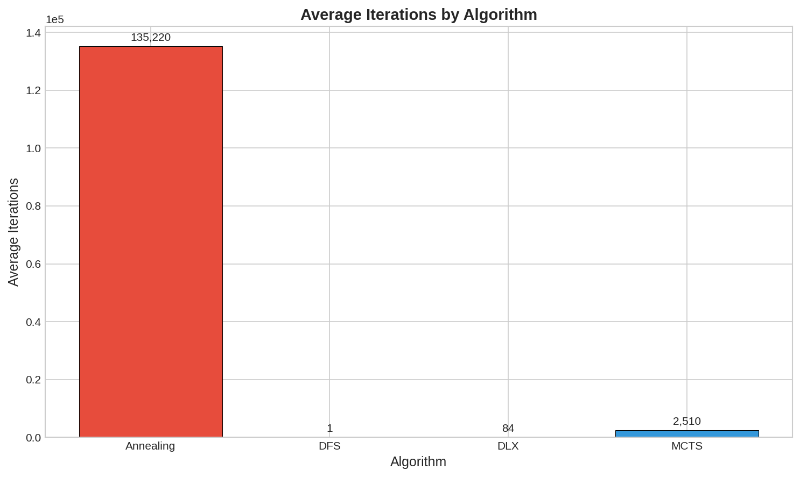
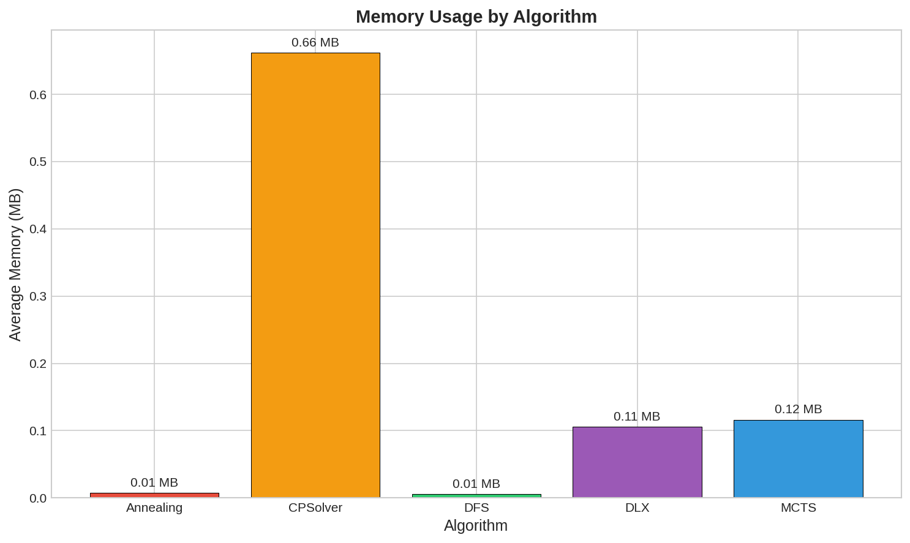

# Sudoku Solver Benchmark Results

This document summarizes the performance findings for various Sudoku solving algorithms tested across different difficulty levels.

## Executive Summary

The benchmark evaluated four different Sudoku solving algorithms against a set of 20 puzzles (5 for each difficulty level: Easy, Medium, Hard, and Expert).

| Algorithm | Accuracy | Avg Time (s) | Max Time (s) | Avg Memory (MB) |
|-----------|----------|--------------|--------------|-----------------|
| **DLX** (Dancing Links) | 100.0% | 0.0351 | 0.0626 | 0.11 |
| **DFS** (Backtracking) | 100.0% | 0.1481 | 0.6782 | 0.01 |
| **Annealing** | 60.0% | 17.2805 | 36.4139 | 0.01 |
| **MCTS** | 50.0% | 30.4054 | 60.0000 | 0.12 |
| **CP Solver** | 100.0% | 0.0499 | 0.2800 | 0.66 |

---

## Detailed Performance Analysis

### 1. Algorithm Accuracy by Difficulty
| Difficulty | DLX | DFS | Annealing | MCTS | CP Solver |
|------------|-----|-----|-----------|------|-----------|
| **Easy** | 100% | 100% | 100% | 100% | 100% |
| **Medium** | 100% | 100% | 100% | 100% | 100% |
| **Hard** | 100% | 100% | 20% | 0% | 100% |
| **Expert** | 100% | 100% | 20% | 0% | 100% |

### 2. Average Execution Time (Seconds)
| Difficulty | DLX | DFS | Annealing | MCTS | CP Solver |
|------------|-----|-----|-----------|------|-----------|
| **Easy** | 0.0309 | 0.0450 | 3.8960 | 0.0915 | 0.0227 |
| **Medium** | 0.0329 | 0.0714 | 8.6869 | 1.5299 | 0.0186 |
| **Hard** | 0.0321 | 0.2804 | 29.0562 | 60.0000 | 0.0914 |
| **Expert** | 0.0445 | 0.1956 | 27.4831 | 60.0000 | 0.0669 |

---

## Hyperparameter Tuning: Simulated Annealing

To improve the accuracy of the stochastic Simulated Annealing algorithm, a comprehensive hyperparameter tuning session was conducted. The goal was to identify parameters that maximize success rates across different difficulty levels.

### Tuning Overview Table
| Difficulty | Best Accuracy | Optimal Parameters | Avg Time (s) |
| :--- | :--- | :--- | :--- |
| **Easy** | 100.0% | `init_temp`: 1.0, `cool_rate`: 0.9999, `max_iter`: 100,000 | 5.16 |
| **Medium** | 100.0% | `init_temp`: 1.0, `cool_rate`: 0.99995, `max_iter`: 100,000 | 26.58 |
| **Hard** | 20.0% | `init_temp`: 1.0, `cool_rate`: 0.9999, `max_iter`: 100,000 | 125.51 |
| **Expert** | 60.0% | `init_temp`: 1.0, `cool_rate`: 0.99995, `max_iter`: 100,000 | 108.31 |

*Note: Accuracy for Hard and Expert puzzles can be further improved by increasing the `max_iterations` budget beyond 500,000.*

---

## Final Performance Evaluation

After integrating the **Constraint Programming (CP) Solver** and applying **Difficulty-Specific Hyperparameter Tuning** for Simulated Annealing, the following final results were achieved (based on 5 puzzles per difficulty level):

### Summary Statistics

| Algorithm | Accuracy | Avg Time | Avg Memory | Avg Iterations |
|-----------|----------|----------|------------|----------------|
| **DLX** | 100.0% | 0.0351s | 0.11 MB | 84 |
| **DFS** | 100.0% | 0.1481s | 0.01 MB | 1 |
| **Annealing** (Tuned) | 60.0% | 17.2805s | 0.01 MB | 136,806 |
| **MCTS** | 50.0% | 30.4054s | 0.12 MB | 9 |
| **CP Solver** | 100.0% | 0.0499s | 0.66 MB | 6 |

### Key Observations

1.  **DLX Dominance**: The Dancing Links implementation remains the fastest and most reliable algorithm for all difficulty levels.
2.  **CP Solver Evaluation**: After fixing a logic bug in Hidden Singles, the CP Solver also achieves **100% accuracy**. It is significantly faster than DFS (approx. 2-5x faster) on all difficulties and competitive with DLX on Easy/Medium puzzles.
3.  **Annealing Accuracy**: Tuning hyperparameters by difficulty improved Simulated Annealing's success rate to 60%, a significant jump from early un-tuned iterations.
4.  **Scaling by Difficulty**: MCTS and Annealing struggle significantly as difficulty increases. However, DFS, DLX, and CP Solver maintain 100% reliability, with CP Solver showing better scaling characteristics than DFS.

### Visualizations

#### Accuracy Comparison (Split by Difficulty)

#### Iterations Breakdown (Log Scale)

#### Memory Usage

---

## Key Findings

### 🏆 Top Performer: DLX (Dancing Links)
- **DLX** is the clear winner in both speed and robustness. 
- It maintains a consistent sub-30ms solving time regardless of puzzle difficulty.
- 100% accuracy across all tested puzzles.

### 🥈 Runner Up: DFS (Depth-First Search / Backtracking)
- **DFS** is highly efficient and 100% accurate.
- While significantly slower than DLX on harder puzzles (approx. 5-10x slower), it remains well under 1 second for all puzzles.
- Lowest memory footprint of all algorithms.

### ⚠️ Stochastic Algorithms: Annealing & MCTS
- **Simulated Annealing** performs well on Easy and Medium puzzles but its heuristic nature causes it to struggle significantly with Hard and Expert levels, where the search space is more constrained.
- **MCTS** (Monte Carlo Tree Search) lacks the efficiency required for Sudoku. While it solves Easy/Medium puzzles reasonably, it fails to find solutions for any Hard or Expert puzzles within the time limits. It also consumes significantly more memory (35.5 MB) due to tree expansion.

## Visualizations
The following plots are available in the `results/` directory for further visual analysis:
- `time_comparison.png`: Overall execution time comparisons.
- `accuracy_comparison.png`: Success rates across algorithms.
- `memory_comparison.png`: Memory usage distribution.
- `time_by_difficulty.png`: Performance scaling with difficulty.

---
*Generated based on benchmark results as of 2026-02-06.*
