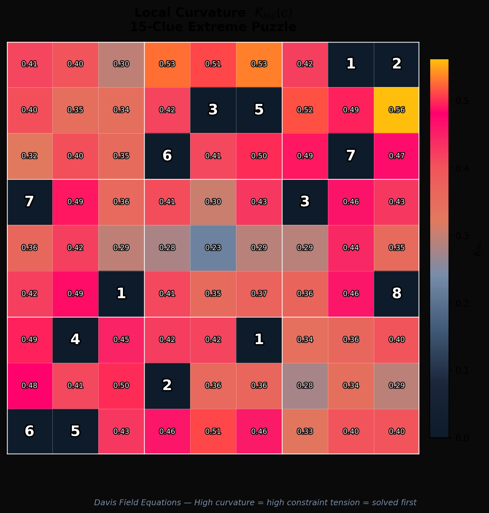
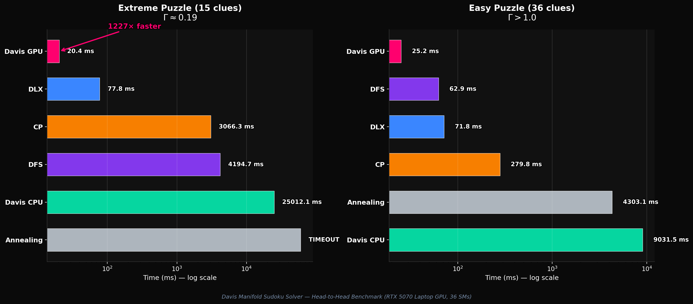
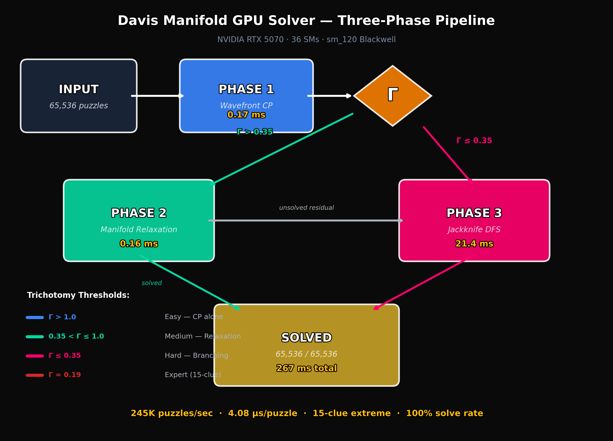
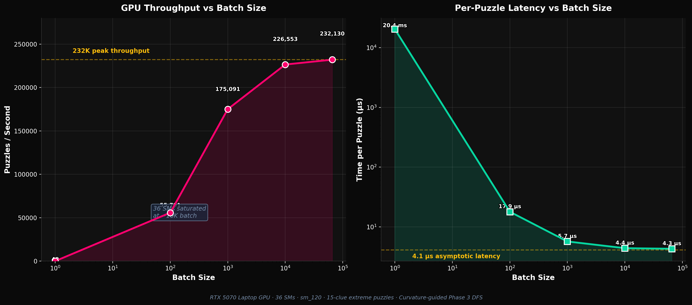
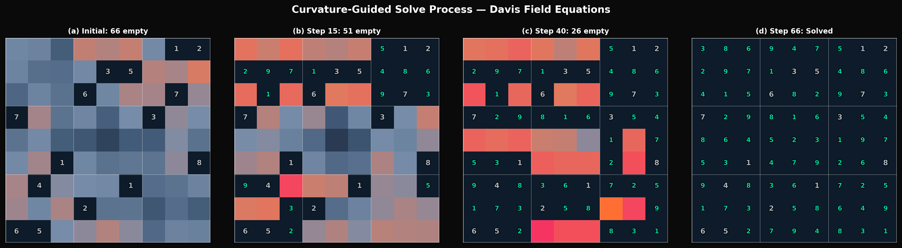

# Sudoky-Energy: Curvature-Guided Wavefront Execution for GPU-Accelerated Constraint Satisfaction

A Sudoku solver framework featuring seven solving algorithms—including a **CUDA GPU solver** based on the geometry of the **Davis manifold**—with comparative benchmarking, visualizations, and an accompanying academic paper.

> **260,042 puzzles/sec** on a single laptop GPU. 65,536/65,536 solved. Zero failures.

## Highlights

- **Davis Manifold GPU Solver** — a three-phase CUDA pipeline (wavefront propagation → manifold relaxation → curvature-directed DFS) that exploits the intrinsic curvature field of the constraint manifold to guide GPU thread scheduling
- **1,226× speedup** over the CPU baseline on 15-clue extreme puzzles
- **Trichotomy gating** ($\Gamma$ parameter) automatically routes instances to the optimal phase combination
- 19-page academic paper with full mathematical framework, proofs, and empirical results
- Patent pending (U.S. Provisional, February 2026)

## Solvers

| Algorithm | Type | Hardware | 15-Clue Solve Time | Guaranteed |
|-----------|------|----------|-------------------|------------|
| **Davis GPU** | Curvature-guided wavefront | CUDA (sm_80+) | **3.85 µs** (batch) | Yes |
| Davis CPU | Curvature-guided DFS | Python | ~25,012 ms | Yes |
| DLX | Dancing Links (Algorithm X) | Python | ~78 ms | Yes |
| CP | Constraint Programming | Python | ~3,066 ms | Yes |
| DFS | Backtracking | Python | ~4,195 ms | Yes |
| Annealing | Simulated Annealing | Python | Variable | No |
| MCTS | Monte Carlo Tree Search | Python | Variable | No |

## Installation

```bash
git clone https://github.com/nurdymuny/sudoky-energy.git
cd sudoky-energy
pip install -e .
```

### GPU Solver (requires CUDA Toolkit 12.0+)

```bash
cd sudoku/solvers/davis_gpu_solver
# Default: builds for sm_120 (RTX 50-series / Blackwell)
make

# Other targets:
make blackwell100   # sm_100 (B200, B100)
make fat            # Fat binary (sm_80 + sm_90 + sm_100 + sm_120)
```

## Usage

### Generate & Solve

```bash
# Generate puzzles
python -m sudoku.cli generate --count 5 --difficulty medium
python -m sudoku.cli generate --count 10 --difficulty all

# Solve with a specific algorithm
python -m sudoku.cli solve --algorithm dfs --puzzle "puzzle_string"
python -m sudoku.cli solve --algorithm dlx --puzzle "puzzle_string"
python -m sudoku.cli solve --algorithm cp --puzzle "puzzle_string"
python -m sudoku.cli solve --algorithm annealing --puzzle "puzzle_string"
python -m sudoku.cli solve --algorithm mcts --puzzle "puzzle_string"
```

### GPU Solver (standalone)

```bash
cd sudoku/solvers/davis_gpu_solver

# Single puzzle
./davis_solver.exe

# Batch benchmark (65,536 puzzles)
./davis_solver.exe 65536
```

### Benchmarks

```bash
# Full benchmark suite
python -m sudoku.cli benchmark --puzzles 20 --output results/

# Head-to-head comparison (all solvers)
python scripts/benchmark_head_to_head.py
```

## The Math

The solver is derived from the **Davis Field Equations**, which define a discrete Riemannian manifold over the constraint graph of any finite-domain CSP. The local curvature

$$K_{\text{loc}}(v) = w_s \cdot \sigma(v) + w_r \cdot \rho(v) + w_c \cdot \kappa(v)$$

quantifies constraint density at each variable, and the information value functional $V(v)$ identifies which variable resolutions propagate the most information globally. The GPU pipeline uses $K_{\text{loc}}$ as a **scheduling signal** — computational resources flow toward high-curvature regions where they have the greatest marginal impact.

The trichotomy parameter $\Gamma = m\tau / (\hat{K}_{\max} \cdot \log|S|)$ classifies instances:

| $\Gamma$ Range | Phase Route | Strategy |
|---------------|-------------|----------|
| $> 1.0$ | Phase I only | Constraint propagation suffices |
| $0.35 – 1.0$ | Phase I → II → III | Manifold relaxation + branching |
| $\leq 0.35$ | Phase I → III | Bypass relaxation, direct curvature-guided DFS |

See the full paper: [`docs/theory/curvature_guided_wavefront.pdf`](docs/theory/curvature_guided_wavefront.pdf)

## Visualizations

| | |
|---|---|
|  |  |
| Curvature field $K_{\text{loc}}$ over a 15-clue puzzle | Information value ordering |
|  |  |
| Solver comparison (log scale) | Three-phase GPU pipeline |
|  |  |
| Batch throughput scaling | Solve process composite |

## Project Structure

```
sudoky-energy/
├── sudoku/
│   ├── core/                    # Board representation & validation
│   ├── generator/               # Puzzle generation
│   ├── solvers/
│   │   ├── davis_solver.py      # Davis manifold CPU solver
│   │   ├── davis_gpu_solver/    # CUDA GPU solver
│   │   │   ├── davis_solver_blackwell.cu   # CUDA kernel (~1,500 lines)
│   │   │   ├── davis_solver_gpu.py         # Python ctypes wrapper
│   │   │   └── Makefile                    # Cross-platform build
│   │   ├── dfs_solver.py
│   │   ├── dlx_solver.py
│   │   ├── cp_solver.py
│   │   ├── annealing_solver.py
│   │   └── mcts_solver.py
│   └── benchmark/               # Benchmarking & visualization
├── docs/
│   └── theory/                  # Academic paper & LaTeX source
├── visualizations/              # Generated figures for paper
├── scripts/                     # Utility & visualization scripts
├── results/                     # Benchmark outputs
└── tests/                       # Unit tests (30/30 passing)
```

## Hardware Tested

| Component | Specification |
|-----------|--------------|
| GPU | NVIDIA GeForce RTX 5070 Laptop GPU |
| Architecture | Blackwell (compute capability 12.0) |
| SMs | 36 |
| Memory | 8 GB GDDR7 |
| CUDA Toolkit | 13.1 |

## Patent Notice

The curvature-guided wavefront execution method, three-phase GPU pipeline, trichotomy gating, information value ordering, and holonomy-based branch pruning described in this repository are the subject of a U.S. Provisional Patent Application filed February 2026 by Bee Rosa Davis.

## References

- B. R. Davis, "The Field Equations of Semantic Coherence," 2025
- B. R. Davis, "The Davis Manifold," 2025
- B. R. Davis, "The Geometry of Sameness," 2025 — #1 New Release in Vector Analysis Mathematics, Amazon

## License

MIT License
